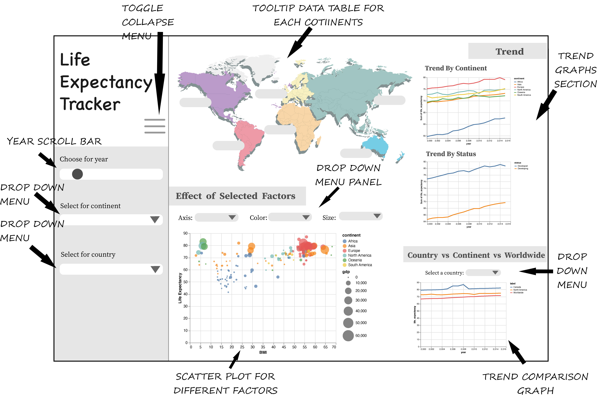

Proposal
================
Authors: Debananda Sarkar, Zhanyi Su, Junting He, Joshua Lim

-   [Section 1: Motivation and
    Purpose](#section-1-motivation-and-purpose)
-   [Section 2: Description of the
    data](#section-2-description-of-the-data)
-   [Section 3: Usage scenarios](#section-3-usage-scenarios)
-   [Section 4: Sketch of the App](#section-4-sketch-of-the-app)
-   [Reference](#reference)

## Section 1: Motivation and Purpose

Our role: UBC data scientist team

Target audience: Public Communication

In the past, there have been a lot of studies undertaken to increase
human life expectancy including factors of demographic variables, income
composition, and mortality rates. It has been one of the wonders of the
last century. However, in the past 30 years, there have been a lot of
improvements in the health care sector but the effects of health care
improvement, such as immunization and human development index, were not
taken into consideration in some previous projects. If we could
understand factors related to immunization and the human development
index, it may be possible for a human to have a much longer life
expectancy.

To address this challenge, we propose building a data visualization app
that allows the public to visually explore a dataset of life expectancy
together with variables including immunization factors, mortality
factors, economic factors, social factors, and other health-related
factors. Our app will show the trend of life expectancy over years, and
the influence of each contributing factor. Not only that, users are
allowed to explore different aspects of this data by slicing and dicing
on different variables to compare factors that contribute to absence.

## Section 2: Description of the data

The dataset we will be visualizing consists of 2938 observations for 193
countries from the year 2000 - 2015, which represent immunization
related factors (`Hepatitis B`, `Polio` and `Diphtheria`), mortality
factors (`Adult Mortality` and `Infant Death`), economical factors
(`Status`, `Total Expenditure` and `GDP`) and social factors
(`Population` and `Schooling`) that contribute to the life expectancy of
a country in a given year. We will draw a visualization map that shows
how each factor influence the life expectancy of the country’s
population and hopefully could provide some insights to policymakers.

## Section 3: Usage scenarios

Angie is a manager of a newly formed special division in the United
Nations, responsible for tracking life expectancy across the world,
advising policymakers who are responsible for making decisions about
administrative and financial aides and creating public awareness about
life expectancy in developing countries and its contributing factors.
Angie and most of her team members are very passionate about how to
improve the quality of life around the world and dedicated a good part
of their life to help people living in questionable conditions.

As part of the first milestone, Angie wants to have a dashboard for
tracking average life expectancy which can be used by her team, the
policymakers in the UN, and the general public to understand how life
expectancy has changed over time and the factors affecting it. Based on
this dashboard, Angie’s team will report how life expectancy has changed
over time in every corner of the world and whether the steps taken by
the UN in the last 15 years are making a difference.

Angie’s team reached out to the data scientists team of MDS DSCI 532
group 4 to build the initial version of the dashboard using publicly
available data from the last 15 years. Angie is hoping that the users
should be able to filter the dashboard based on year, multiple
continents, and countries. The dashboard should communicate the key
performance indicators and other indicators to the audience in a visible
way. Additionally, the users should be able to visualize the trend of
life expectancy by year based on the continent, country, and status on
the dashboard. The dashboard should enable users to perform
multi-dimensional analysis to understand factors affecting life
expectancy.

## Section 4: Sketch of the App

## Reference

-   [Life Expectancy
    dataset](https://www.kaggle.com/kumarajarshi/life-expectancy-who)
